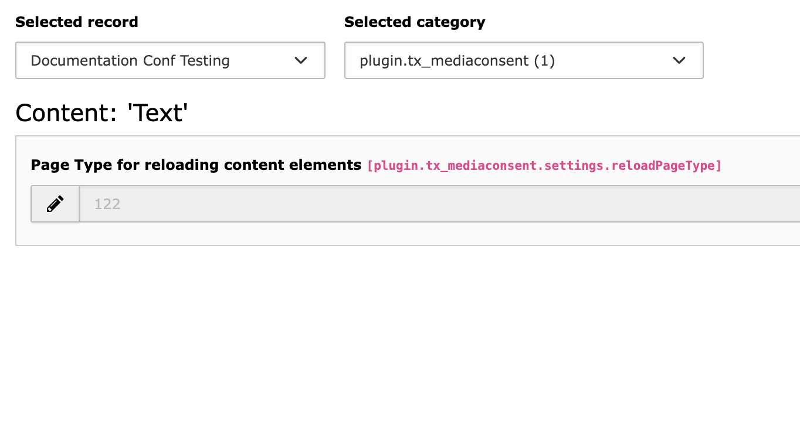

..  include:: /Includes.rst.txt

..  _admin-manual:

====================
Administrator Manual
====================

..  _admin-installation:

Installation
============

To install the extension, perform the following steps:

*   Go to the Extension Manager
*   Install the extension
*   Select the static template

..  figure:: ../Images/static_template.png
    :alt: Select static template

    After install, select the static template

..  important::

    This extensions adds a little JavaScript to the webpage. Therefore it
    assumes that the top-level TypoScript object of type PAGE is named "page" as
    it is generally recommended.

..  code-block:: typoscript

    # Include JavaScript functions for reloading Content Element.
    # Assumes "page" as name for top level PAGE Object
    page.includeJSFooter.tx_mediaconsent = EXT:mediaconsent/Resources/Public/JavaScript/MediaConsent.js

Editing Constants
=================

   Constants for the reload page type

Another constant (reloadPageType) deals with the very rare case that you already
use a pagetype of 122 somewhere in your typoscript configuration. Then you can
change it here.
